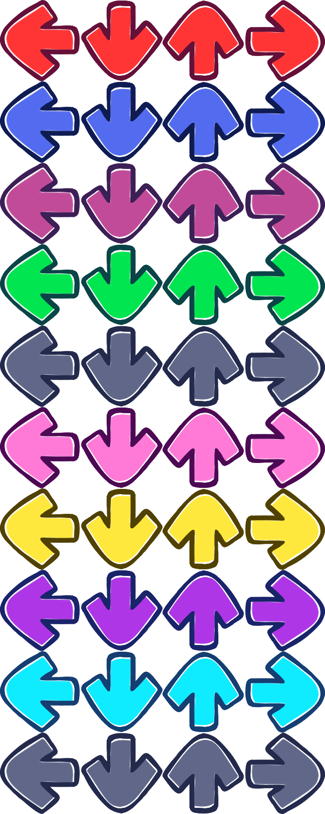
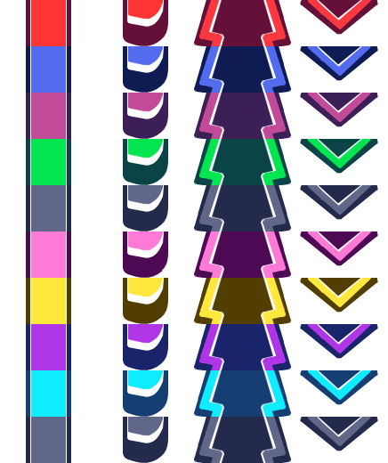

Noteskins
=========

**Noteskins** change the appearance of notes.
In base *Friday Night Funkin*, noteskins are stored within a singular image, attached with an xml file which defines the position of each note.
**Forever Engine** expands upon this system, allowing for the use of Quantization, as well as different note types.

Forever Engine includes an optimized version of the default noteskin, which can be used as a base to make new noteskins.

Note Types
----------

Forever Engine supports most note types used in Stepmania. These include:

- Notes

  The standard note. Usually appears as an arrow, or less commonly a bar or circle.

- Holds

  A regular note with a 'tail' that must be held for a period of time. In Forever Engine, Hold notes are made up of three parts; The note, the body and the tail. 

- Mines

  Hitting mines reduces your health and score. Commonly appears as a spinning grey disc with a red inside, an X, or a flaming arrow.

- Rolls

  A regular note with a jagged tail. Instead of holding the note, Rolls must be repeatedly tapped for the roll tail duration. Usually appears as a yellow, jagged hold.

Formatting
----------
As of version 0.2.3, Forever Engine's noteskins are held inside the Assets > Art > Noteskins > Notes folder.
Each subfolder represents one unique noteskin, the name of which is based on the folder name.

There are two types of note formats:

- The base game's XML format
- Forever Engine's hardcoded grid-based quant format (temporary)

Currently the quant format is hardcoded, made of 2 images. 

NOTE_quants.png, which uses a **4x10** grid made of **157px x 157px** blocks,
and HOLD_quants.png, which uses a **4x10** grid made of **109px x 52px** blocks.

NOTE_quants.png has 4 columns, which correspond to each arrow.

HOLD_quants.png has 4 columns. These are used for the hold body, hold tail, roll body, and roll tail.

These are the noteskin references.
You can use these as a template for your custom noteskins.

  
  Fig. 1: Note quants grid

  
  Fig. 2: Hold quants grid
